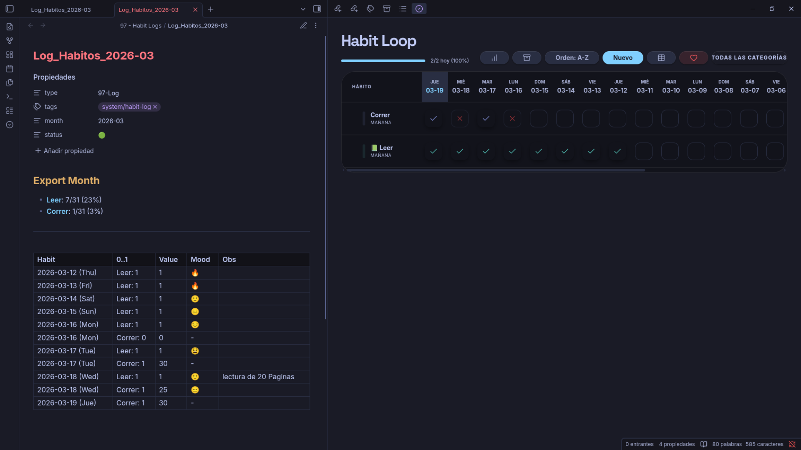

# 🔄 Habit Loop Tracker for Obsidian

**Habit Loop Tracker** es un plugin premium para [Obsidian](https://obsidian.md) diseñado para construir consistencia a largo plazo. Basado en el algoritmo de **puntuación exponencial**, este plugin te permite fallar sin perder tu progreso, enfocándose en la "fuerza" del hábito en lugar de simples rachas.

## 📺 Vista Previa

| **Dashboard Global** | **Creación de Hábitos** |
|:---:|:---:|
|  |  |

| **Vista de Cuadrícula** | **Analíticas Avanzadas** |
|:---:|:---:|
|  |  |

> [!TIP]
> **Explora el Plugin**: Mira el flujo completo de registro y analíticas en acción.
> 

---

## 🏗️ Créditos y Origen

Este plugin es un **fork** adaptado para Obsidian del excelente proyecto de código abierto **[Loop Habit Tracker](https://github.com/iSoron/uhabits)** (Android), creado por **Álinson Santos Xavier**. 

Respetamos la esencia del algoritmo original para traer la mejor experiencia de seguimiento de hábitos a tu base de conocimientos personal. Este proyecto se distribuye bajo la licencia **GPL-3.0**.

---

## 🚀 Instalación Rápida

### Manual (Recomendado)
1. Descarga `main.js`, `manifest.json` y `styles.css` de la última **[Release](https://github.com/our-blank-space/3-Obsi-Uhabits-Fork/releases)**.
2. Colócalos en `.obsidian/plugins/obsidian-habit-tracker/`.
3. Activa el plugin en la configuración de Obsidian.

---

## 🎨 Guía de Uso

1.  **Crea**: Usa el botón **"+ Nuevo"** para definir tus metas.
2.  **Registra**: Toca una celda para marcar progreso. Mantén presionado para detalles.
3.  **Analiza**: Haz clic en el nombre del hábito para ver estadísticas avanzadas.

---

## 💎 Soporte y Servicios

¿Te ha resultado útil **Habit Loop Tracker**? Acepto donaciones que se destinan a futuros esfuerzos de desarrollo. Para este proyecto de hobby, no acepto pagos por recompensas de errores o solicitudes de funciones para evitar presiones adicionales.

Sin embargo, **si necesitas un proyecto específico y personalizado en Obsidian**, también puedes contactarme para su desarrollo como un servicio profesional.

### ¡Apoya el desarrollo o contacta conmigo!

---

*Desarrollado con ❤️ para la comunidad de Obsidian.*

