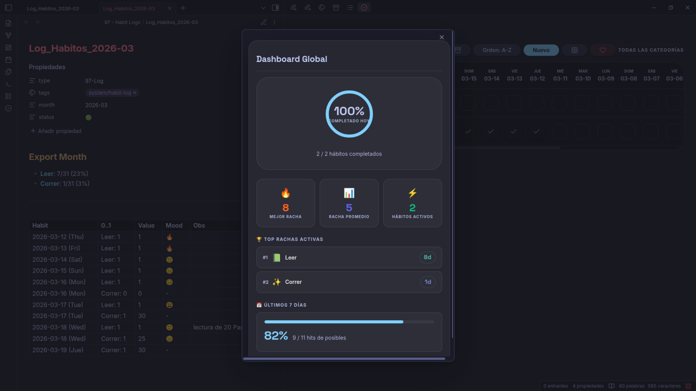
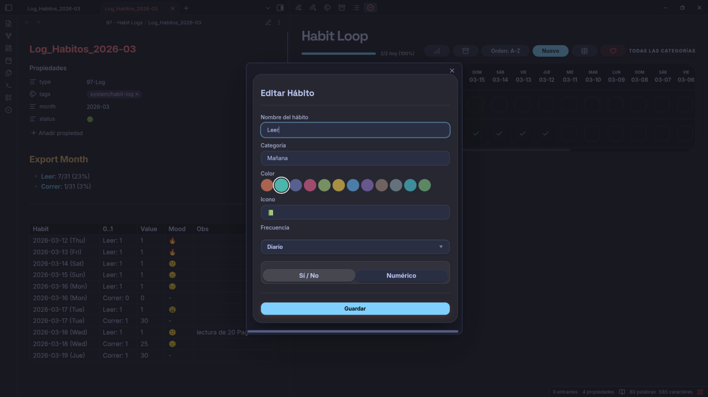
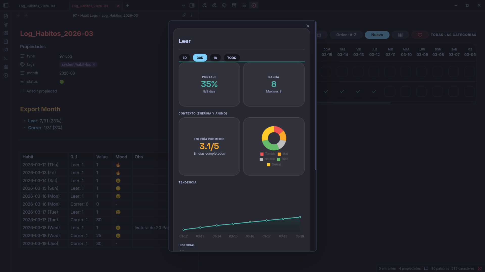
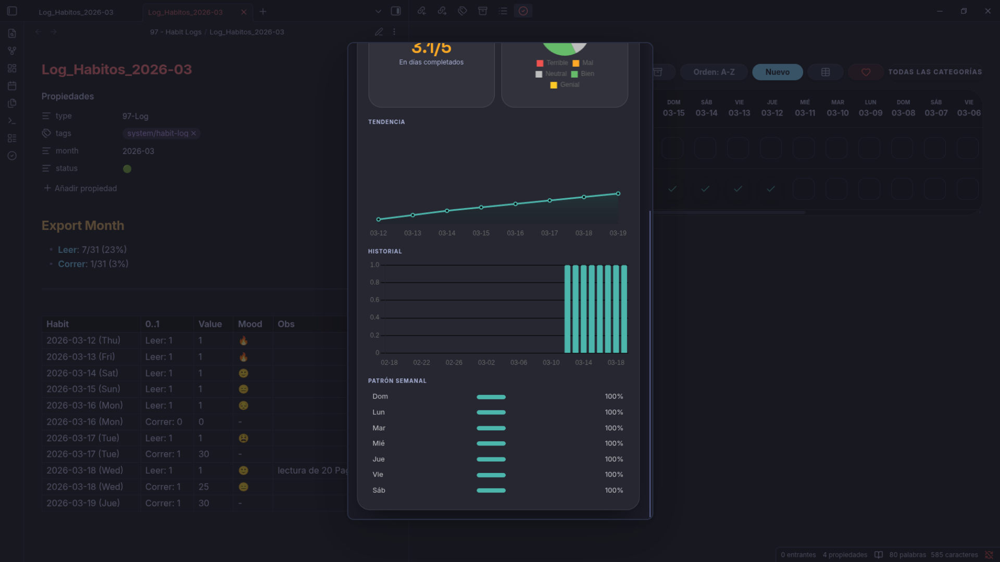

# 🔄 Habit Loop Tracker for Obsidian

**Habit Loop Tracker** es un plugin premium para [Obsidian](https://obsidian.md) diseñado para construir consistencia a largo plazo. Basado en el algoritmo de **puntuación exponencial**, este plugin te permite fallar sin perder tu progreso, enfocándose en la "fuerza" del hábito en lugar de simples rachas.

## 📺 Vista Previa

| **Dashboard Global** | **Creación de Hábitos** |
|:---:|:---:|
|  |  |

| **Analíticas Avanzadas** | **Tendencias y Contexto** |
|:---:|:---:|
|  |  |

> [!TIP]
> **Explora el Plugin**: Mira el video de demostración para ver el flujo completo de registro y analíticas.
> 

---

## ✨ Características Principales

*   **📊 Loop Score:** Algoritmo que mide la fuerza real de tu hábito.
*   **🧠 Métricas de Contexto:** Registra tu ánimo y energía junto con tus hábitos.
*   **📈 Analíticas Pro:** Gráficos de tendencia, mapas de calor y distribución de ánimo.
*   **🔢 Tipos Flexibles:** Soporte para hábitos binarios (Sí/No) y cuantitativos.
*   **📝 Notas Diarias:** Integración profunda con notas de registro en Markdown.
*   **📅 Vista Adaptive:** Interfaz fluida con scroll horizontal y organización manual.

---

## 🏗️ Créditos y Origen

Este plugin es un **fork** adaptado para Obsidian del excelente proyecto de código abierto **[Loop Habit Tracker](https://github.com/iSoron/uhabits)** (Android), creado por **Álinson Santos Xavier**. 

Respetamos la esencia del algoritmo original para traer la mejor experiencia de seguimiento de hábitos a tu base de conocimientos personal. Este proyecto se distribuye bajo la licencia **GPL-3.0**.

---

## 🚀 Instalación Rápida

### Manual (Recomendado)
1. Descarga `main.js`, `manifest.json` y `styles.css` de la última **[Release](https://github.com/tu-usuario/obsidian-habit-tracker/releases)**.
2. Colócalos en `.obsidian/plugins/obsidian-habit-tracker/`.
3. Activa el plugin en la configuración de Obsidian.

---

## 🎨 Guía de Uso

1.  **Crea**: Usa el botón **"+ Nuevo"** para definir tus metas.
2.  **Registra**: Toca una celda para marcar progreso. Mantén presionado para detalles.
3.  **Analiza**: Haz clic en el nombre del hábito para ver estadísticas avanzadas.

---

## 💎 Soporte y Proceso

Este proyecto está en constante evolución. Si encuentras valor en este plugin, considera apoyar su desarrollo:

*   **Donaciones**: [Apóyame en Ko-fi](https://ko-fi.com/andresvega) ☕
*   **Reportes**: Si encuentras errores o tienes sugerencias, abre un issue en GitHub.

Tu apoyo ayuda a mantener este proyecto gratuito, de código abierto y en constante mejora para todos.

---

*Desarrollado con ❤️ para la comunidad de Obsidian.*
